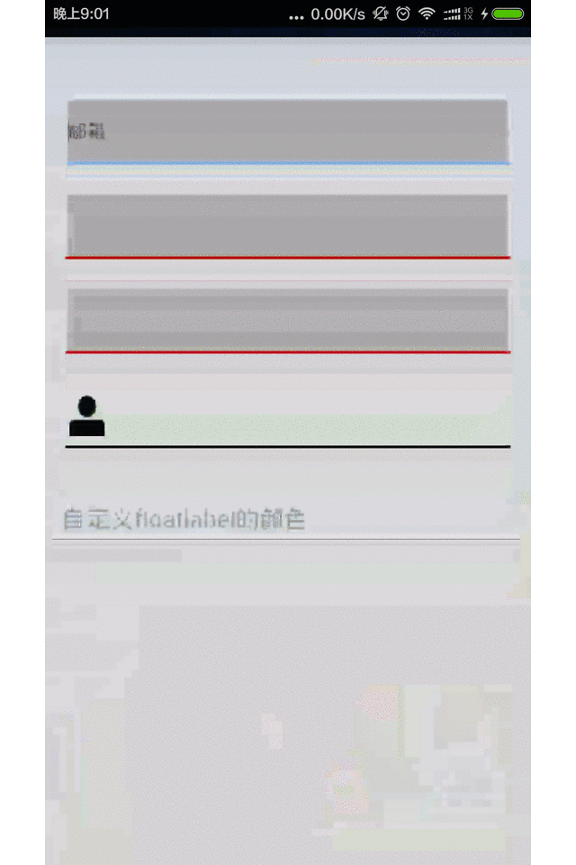

#MyEditText
- - - -
自定义的EditText组件

支持自定义下滑线，下滑线可更改颜色、高度，带FloatLabel的浮动显示，与开发者头条app注册填写一样的效果，支持自定义EditText带删除图标和标识图标。

FloatLablel的功能来自 [IanGClifton](https://github.com/IanGClifton/AndroidFloatLabel")，需要添加依赖库


##依赖库
***
 ```bash
compile 'com.iangclifton.android:floatlabel:1.0.4'
```

##示例



##MyEditText的使用
在xml布局文件里添加如下布局文件:<br/>


 ```bash
     <net.anumbrella.customedittext.MyEditText
        android:layout_width="match_parent"
        android:layout_height="50dip"
        android:layout_marginLeft="15dip"
        android:layout_marginRight="15dip"
        android:layout_marginTop="20dip"
        android:drawableLeft="@mipmap/user_login"
        android:drawableRight="@mipmap/ic_edittext_delete"
        android:focusable="true"
        android:gravity="center_vertical"
        android:paddingLeft="3dip"
        android:singleLine="true"
        anumbrella:displayDelete="true"
        anumbrella:unselectedColor="#000000" />
```

属性列表<br/>


 ```bash
        <!--设置没有选择时的颜色-->
        <attr name="unselectedColor" format="color" />
        <!--设置选择时的颜色-->
        <attr name="selectedColor" format="color" />
        <!--设置出错时的颜色-->
        <attr name="errorColor" format="color" />
        <!-- 设置是否显示EditText中的删除图标-->
        <attr name="displayDelete" format="boolean" />
        <!-- 设置选中时下划线的高度-->
        <attr name="selectUnderlineHeight" format="dimension" />
        <!-- 设置没有选中时下滑线的高度-->
        <attr name="unSelectUnderlineHeight" format="dimension" />
        <!-- 设置错误时下滑线的高度-->
        <attr name="errorUnderlineHeight" format="dimension" />
```


<br/>
平时在EditText里可以定义的属性一样可以使用

而AndroidFloatLabel可以使用自己定义的EditText,也可以使用默认的，直接在xml中定义:


<br/>
 ```bash
    <com.iangclifton.android.floatlabel.FloatLabel
        android:id="@+id/float_label_4"
        android:layout_width="match_parent"
        android:layout_height="wrap_content"
        android:layout_marginTop="20dip"
        android:hint="自定义floatlabel的颜色"
        android:textColorHint="@drawable/custom_hint_color"
        floatlabel:floatLabelColor="#FF0000" />
```


<br/>
使用自定义的EditText,如使用MyEditText,新建立布局文件如下:

<merge xmlns:android="http://schemas.android.com/apk/res/android"
    xmlns:anumbrella="http://schemas.android.com/apk/res-auto">

    <TextView
        android:id="@+id/float_label"
        android:layout_width="match_parent"
        android:layout_height="wrap_content"
        android:textAppearance="?android:attr/textAppearanceMedium"
        android:textColor="#FF1306DD"
        android:textStyle="bold"
        android:typeface="monospace" />

    <net.anumbrella.customedittext.MyEditText
        android:id="@+id/edit_text"
        android:layout_width="match_parent"
        android:layout_height="50dip"
        android:paddingLeft="2dip"
        android:gravity="center_vertical"
        anumbrella:displayDelete="false"
        android:background="@drawable/bg_edittext"
        android:drawableRight="@mipmap/ic_edittext_delete"
        android:singleLine="true" />

</merge>

注意id必须为@+id/float_label和@+id/edit_text。

<br/>

具体的用法请看Demo


##License:

```bash
               Copyright 2015 Anumbrella
Licensed under the Apache License, Version 2.0 (the "License");
you may not use this file except in compliance with the License.
You may obtain a copy of the License at 
        http://www.apache.org/licenses/LICENSE-2.0
Unless required by applicable law or agreed to in writing, software
distributed under the License is distributed on an "AS IS" BASIS,
WITHOUT WARRANTIES OR CONDITIONS OF ANY KIND, either express or implied.
See the License for the specific language governing permissions and
limitations under the License.
```


