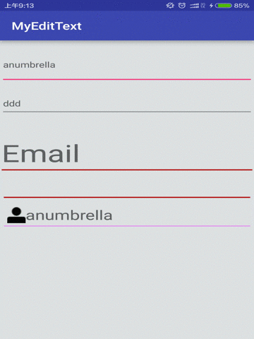

# CustomEditText

自定义的EditText组件

支持自定义下滑线，下滑线可更改颜色、高度，带FloatLabel的浮动显示，与开发者头条app注册填写一样的效果，支持自定义EditText带删除图标和标识图标。支持浮动动画自定义和视图自定义。

包含两个文件:
	MyEditText:自定义的EditText
	FloatLabelView:带浮动的EdiText

## 示例


## MyEditText的使用
默认是不会显示右边的删除图标。如果要显示，指定属性displayDelete="true"即可。同时也可自定义图标android:drawableRight即可。支持点击时下划线颜色、高度、没有焦点时下划线颜色的指定。

在xml布局文件里添加如下布局文件:
<br/>


 ```bash
     <net.anumbrella.customedittext.MyEditText
        android:layout_width="match_parent"
        android:layout_height="50dip"
        android:layout_marginLeft="15dip"
        android:layout_marginRight="15dip"
        android:layout_marginTop="20dip"
        android:drawableLeft="@mipmap/user_login"
        android:drawableRight="@mipmap/ic_edittext_delete"
        android:focusable="true"
        android:gravity="center_vertical"
        android:paddingLeft="3dip"
        android:singleLine="true"
        anumbrella:displayDelete="true"
        anumbrella:unselectedColor="#000000" />
```

属性列表(MyEditText)


 ```bash
        <!--设置没有选择时的颜色-->
        <attr name="unselectedColor" format="color" />
        <!--设置选择时的颜色-->
        <attr name="selectedColor" format="color" />
        <!--设置出错时的颜色-->
        <attr name="errorColor" format="color" />
        <!-- 设置是否显示EditText中的删除图标-->
        <attr name="displayDelete" format="boolean" />
        <!-- 设置选中时下划线的高度-->
        <attr name="selectUnderlineHeight" format="dimension" />
        <!-- 设置没有选中时下滑线的高度-->
        <attr name="unSelectUnderlineHeight" format="dimension" />
        <!-- 设置错误时下滑线的高度-->
        <attr name="errorUnderlineHeight" format="dimension" />
```


平时在EditText里可以定义的属性一样可以使用


##FloatLabelView的使用
代码参考自[IanGClifton](https://github.com/IanGClifton/AndroidFloatLabel),添加了部分功能并进行了修改。
默认是EditText和TextView结合的视图显示。可以自定义浮动字体的颜色，大小，与EdiText的上下距离，与屏幕左边的距离。同时也可以支持自定义的TextView和EditText显示。把id设置为具体的@+id/float_label和@+id/edit_text。

在xml布局文件里添加如下布局文件:


 ```bash
    <net.anumbrella.customedittext.FloatLabelView
        android:layout_width="match_parent"
        android:layout_height="wrap_content"
        android:layout_marginTop="20dip"
        android:hint="anumbrella"
        android:textColorHint="@drawable/custom_hint_color"
        anumbrella:floatLabelColor="#FF0000"
        anumbrella:bottomDistance="15dip"
        anumbrella:leftDistance="50dip" />
```

属性列表(FloatLabelView)


 ```bash
        <!--默认提示字体-->
        <attr name="android:hint" />
        <!--输入类型-->
        <attr name="android:inputType" />
        <!--布局视图资源-->
        <attr name="android:layout" />
        <!--各个方向获取焦点-->
        <attr name="android:nextFocusDown" />
        <attr name="android:nextFocusForward" />
        <attr name="android:nextFocusLeft" />
        <attr name="android:nextFocusRight" />
        <attr name="android:nextFocusUp" />
        <!--手机输入法软键盘回车的功能设置-->
        <attr name="android:imeOptions" />
        <!--EditText的文本-->
        <attr name="android:text" />
        <!--EditText提示字体的颜色-->
        <attr name="android:textColorHint" />
        <!--浮动字体的颜色-->
        <attr name="floatLabelColor" format="color" />
        <!--自定义TextView的id-->
        <attr name="labelId" format="reference" />
        <!--自定义EditText的id-->
        <attr name="editTextId" format="reference" />
        <!--FloatLabel显示的方式-->
        <attr name="floatLabelDisplay" format="dimension" />
        <!--FloatLable与左边的margin距离-->
        <attr name="leftDistance" format="dimension" />
        <!--FloatLable与EditText距离-->
        <attr name="bottomDistance" format="dimension" />
        <!--FloatLable字体的大小-->
        <attr name="labelTextSize" format="dimension" />
        <!--EidtText字体的大小-->
        <attr name="editTextSize" format="dimension" />
```
<br/>


同时也可以使用你自己的自定义视图:

<TextView
    android:id="@+id/float_label"
    android:layout_width="match_parent"
    android:layout_height="wrap_content"
    android:textAppearance="?android:attr/textAppearanceMedium"
    android:textColor="#FF1306DD"
    android:textStyle="bold"
    android:typeface="monospace" />

<net.anumbrella.customedittext.MyEditText
    android:id="@+id/edit_text"
    android:layout_width="match_parent"
    android:layout_height="50dip"
    android:paddingLeft="2dip"
    android:gravity="center_vertical"
    anumbrella:displayDelete="false"
    android:background="@drawable/bg_edittext"
    android:drawableRight="@mipmap/ic_edittext_delete"
    android:singleLine="true" />
    
注意id必须为@+id/float_label和@+id/edit_text。 

具体的用法请看Demo。

## 使用方法

在gradle中添加依赖库

 ```bash
compile 'net.anumbrella:customedittext:1.0.0'
```


## License

The Apache Software License, Version 2.0

Copyright  [2015]  [Anumbrella]

Licensed under the Apache License, Version 2.0 (the "License");
you may not use this file except in compliance with the License.
You may obtain a copy of the License at

    http://www.apache.org/licenses/LICENSE-2.0

Unless required by applicable law or agreed to in writing, software
distributed under the License is distributed on an "AS IS" BASIS,
WITHOUT WARRANTIES OR CONDITIONS OF ANY KIND, either express or implied.
See the License for the specific language governing permissions and
limitations under the License.
```


